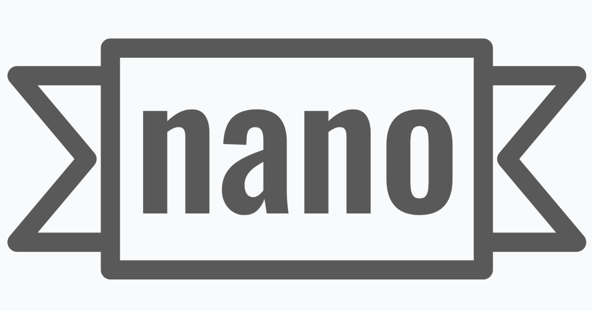

# NanoBanner

<p align="center">
  
</p>

Resize and reframe images into platform-perfect banners, posts, and prints. No accounts, no clutter—just upload, tweak, download.

## Features

- **Single-screen workflow** — Upload, configure, preview, and download on one page
- **Platform presets** — Twitter/X, Instagram, LinkedIn, YouTube, Web (OG, favicons), T-Shirt
- **Adjustment methods** — Fit, Fill (blur extend), Refocus, Crop with focus controls
- **AI mode (Nano Banana)** — Optional Gemini-powered reframing when `NANO_BANANA_API_KEY` is set
- **Client-side processing** — Standard adjustments run in the browser; nothing is uploaded
- **Responsive** — Works on desktop and mobile

## Tech Stack

- SvelteKit + Svelte 5
- Tailwind CSS
- Vercel (adapter included)
- Google GenAI (optional, for AI mode)

## Quick Start

```bash
npm install
npm run dev
```

Open http://localhost:5173

## Environment Variables

| Variable | Required | Description |
|----------|----------|-------------|
| NANO_BANANA_API_KEY | No | Google AI (Gemini) API key. When set, enables the AI (Nano Banana) adjustment mode. |
| NANO_BANANA_MODEL | No | Override the Gemini model (default: gemini-2.5-flash-preview-05-20). |

Copy `.env.example` to `.env` and add your keys.

## Deploy to Vercel

```bash
npm run build
```

Connect the repo to Vercel; the adapter is already configured.

## Scripts

| Command | Description |
|---------|-------------|
| npm run dev | Start dev server |
| npm run build | Production build |
| npm run preview | Preview production build |
| npm run check | Typecheck |
| npm run lint | Lint and format check |
| npm run format | Format code |
| npm run test | Run unit and e2e tests |

## License

Private project.
